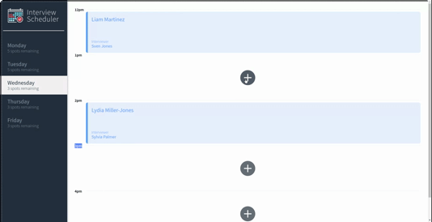
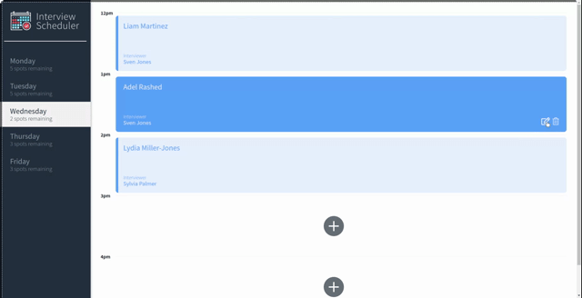
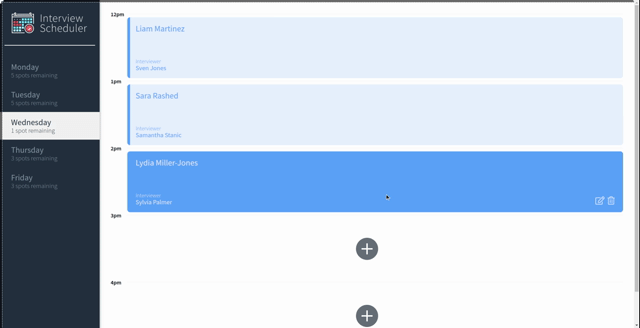

# Interview Scheduler
## Project Description
A React application that allows users to book and cancel interviews.

## Tech Stack
* React
* Webpack,Babel
* Axios
* Postgresql
* Storybook, Webpack Dev Server, Jest, Testing Library

## Screenshots
**Booking an appointment**



**Editing an appointment**



**Deleting an appointment**




## Setup

Install dependencies with `npm install`.

## Running Webpack Development Server

```sh
npm start
```

## Running Jest Test Framework

```sh
npm test
```

## Running Storybook Visual Testbed

```sh
npm run storybook
```

## Setup API Server
Fork and clone the repo [scheduler-api](https://github.com/AdelRashed97/scheduler-api) and then follow the instructions in the README.md
